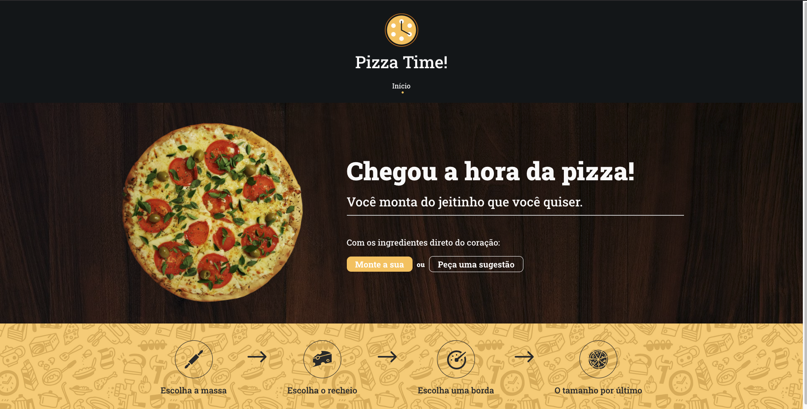
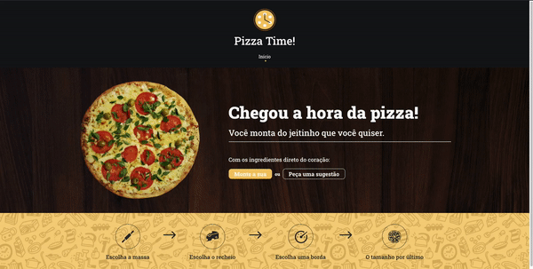

<h1 align="center">
  
</h1>

<h3 align="center">
  Teste para a Stoom utilizando ReactJS
</h3>

Repostório dedicado para realizar o teste proposto pela Stoom, utilizando o ReactJS, junto com o backend integrado com Node.js

<blockquote align="center">“Programs must be written for people to read, and only incidentally for machines to execute.” ― Harold Abelson</blockquote>

  <a href="#sobre-o-teste">Sobre o teste</a>&nbsp;&nbsp;&nbsp;|&nbsp;&nbsp;&nbsp;
  <a href="#funcionamento">Funcionamento</a>&nbsp;&nbsp;&nbsp;|&nbsp;&nbsp;&nbsp;
  <a href="#ver-funcionando">Ver funcionando</a>

## Sobre o teste

Esse é o teste proposto pela [Stoom](https://stoom.com.br/), com o intuito de analisar
e contratar um desenvolvedor front-end.

O teste consistia no desenvolvimento de um formulário, onde fosse possível montar uma pizza ou pedir a sugestão do dia.

<h1 align="center">
  
</h1>

### **Tecnologias utilizadas para o teste**

- :blue_heart: &nbsp; **[ReactJS](https://pt-br.reactjs.org/)** — Biblioteca JavaScript para desenvolvimento de interfaces de páginas web;
- :green_heart: &nbsp;**[Node.js](https://nodejs.org/pt-br/)** — Tecnologia usada para o backend;
- :purple_heart: &nbsp;**[StyledComponents](https://styled-components.com/)** — Biblioteca JavaScript para a estilização de componentes;
- :yellow_heart: &nbsp; Prettier, ESlint e EditorConfig - Tecnologias para padronização de código.
- :blue_heart: &nbsp; TypeScript - Tecnologia para tipagem e melhoria de arquitetura JavaScript.

### **Tecnologia utilizada para o deploy**
- :heart: &nbsp; **[Firebase](https://firebase.google.com/?hl=pt)** — Tecnologia de deploy utilizando devOps.

## Funcionamento

<h1 align="center">
  
</h1>

Como se pode perceber no gif acima, a aplicação consiste em um formulário para a montagem de uma pizza, passando pelas etapas da massa,
do recheio, da borda e do tamanho. Esse fluxo foi desenvolvido utilizando a Context API do React, utilizando da mesma metodologia que
desenvolvedores mobile usam: A Stack.

Uma Stack é uma pilha, e, nesse caso, é uma pilha de componentes. O último componente da pilha sempre é o mostrado em tela, trazendo
uma facilidade maior ao se manipulá-la, apenas removendo o último elemento do array caso o usuário queira voltar um passo.

Além disso, alguns dados estão interligados, como, por exemplo, os comentários embaixo de cada massa, recheio, borda e tamanho vem de um
back-end, como solicitado no teste.

Outro ponto importante para se tocar é a utilização de padronização de código nesse projeto. Para isso, foram utilizados o
ESlint para padronização geral, Prettier para padronização estilística e EditorConfig para padronização entre sistemas operacionais.

<h1 align="center">
  
</h1>

No gif acima, pode-se perceber também que é possível pedir a sugestão do dia. Essa sugestão vem do back-end também, de acordo com
o dia da semana no servidor. Além disso, a requisição é processada e a mensagem do chef é mostrada na tela de conclusão do pedido,
avisando o usuário que ele recebeu pontos de benefício.

Caso haja curiosidade, o código do back-end está [neste](https://github.com/LuccasPiola/desafio-stoom-backend) repositório e está online
como uma aplicação do [Heroku](https://heroku.com), [neste](https://desafio-stoom-backend.herokuapp.com/) link.

## Ver funcionando

Esse teste foi hospedado utilizando o [Firebase](https://firebase.google.com/?hl=pt). Portanto, para acessar o teste, entre
[neste](https://desafio-stoom.web.app/) link. Ao entrar, será possível interagir com a aplicação como um todo. Para análise
de código, este repositório foi criado utilizando a arquitetura de componentização. Sobre a arquitetura de pastas:

 * *assets* - Pasta dedicada à imagens e ícones da aplicação
 * *components* - Componentes reutilizáveis da aplicação
 * *Pasta do componente* - Cada componente possui uma pasta com um arquivo *index.tsx*, ou seja, seu core, e um arquivo *style.ts*, ou seja, sua estilização.
 * *styles* - Definição de estilos globais.
 * *services* - Pasta com serviços externos, como o axios para a utilização da API.
 * *pages* - Pasta com os steps do formulário e também com a página principal.
 * *context* - Pasta dedicada para a utilização da Context API do React.
 * *routes* - Pasta dedicada para as rotas da aplicação.

 Para análise de código, é interessante focar em como foi feita a arquitetura de Steps da aplicação. A parte do contexto da Stack, o StackProvider,
 faz todo o controle da pilha, disponibilizando funções para recuperar o último elemento, instanciar ou remover um elemento, recuperar o tamanho
 da stack, dentre outros.

 Já o FormProvider é justamente para manter uma consistência no formulário da aplicação, para que todos os componentes tenham acesso a ele e também
 a função que o modifica.

 Para ver o formulário preechido, é só montar uma pizza até o final, clicar no botão de finalizar e abrir o console do navegador. Para utilizadores
 de windows e linux, é só apertar F12 e clicar na aba console. Para mac, é só apertar command + shift + i.

 Para análise e ver funcionando diretamente na máquina local:

 1. Clone este repositório utilizando o comando <code>git clone https://github.com/LuccasPiola/desafio-stoom.git</code>
 2. Entre na pasta clonada
 3. Rode o comando <code>yarn</code> no terminal, para a instalação das dependências
 4. Rode o comando <code>yarn start</code> no terminal, uma janela do chrome com o projeto abrirá

---

This test was made by Stoom Repository by Luccas Piola. ♥ &nbsp; for JavaScript.
